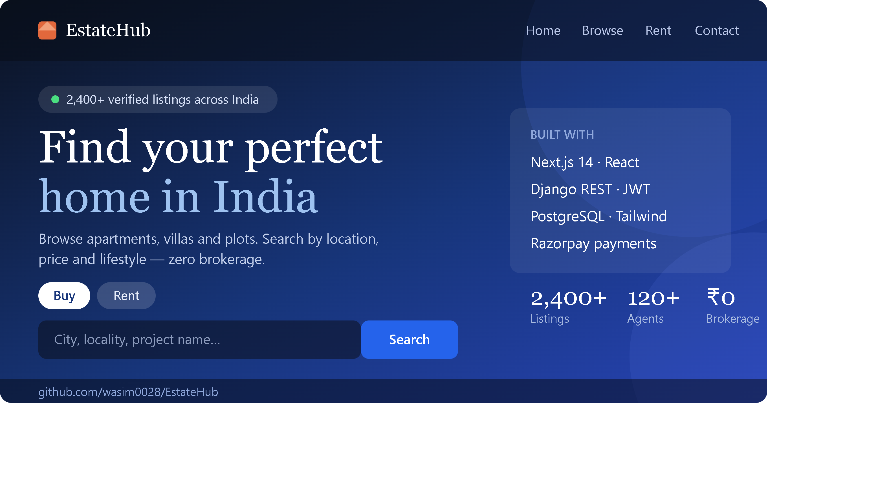

# EstateHub

A real estate marketplace for the Indian market. Buyers browse BHK listings, shortlist
properties, and pay a refundable token to book a site visit; agents manage their inventory,
inquiries, and paid bookings from a role-gated dashboard.

Built with **Next.js 14 (App Router)** and **Django REST Framework**.


---

## Features

**For buyers**
- BHK-first search with filters for city, locality, price, possession status, furnishing, and transaction type
- Prices in Indian notation — ₹45.0 L, ₹1.20 Cr
- Shortlist any listing with the heart icon; review saved properties on a dedicated page
- Book a site visit by paying a refundable token through Razorpay (UPI, cards, netbanking)
- EMI calculator and image gallery on every listing

**For agents**
- Create, edit, and publish listings with drag-and-drop photo upload
- Inquiry inbox with status tracking
- Site-visit dashboard showing who paid, their contact details, and preferred dates

**Throughout**
- Dark mode across every page, persisted and following the OS preference by default
- Responsive down to mobile, with a dedicated navigation menu
- Email-based auth with password reset, in-app password change, and profile editing

---

## Screenshots

> Screenshots live in `docs/screenshots/`. See that folder's README for the capture list.

### Homepage
| Light | Dark |
|---|---|
|  |  |

### Browsing and booking
| Listings with filters | Property detail |
|---|---|
|  |  |

### Agent tools
| Dashboard | Paid site visits |
|---|---|
|  |  |

### Mobile
| Listings | Navigation |
|---|---|
|  |  |

---

## Architecture

```
┌─────────────────────────────────────────────────────────────────┐
│                            BROWSER                              │
│  Client Components: filters, forms, wishlist, theme toggle      │
│  Access token held in memory · JWTs never enter JS scope        │
└──────────────────────────┬──────────────────────────────────────┘
                           │ HTTPS
┌──────────────────────────▼──────────────────────────────────────┐
│                        NEXT.JS SERVER                           │
│  Server Components  ──► fetch() ──► Django API (SSR / ISR)      │
│  Route Handlers     ──► auth proxy, httpOnly cookie management  │
│  Middleware         ──► edge guard on /agent/* (JWT exp check)  │
└──────────────────────────┬──────────────────────────────────────┘
                           │ Internal HTTP
┌──────────────────────────▼──────────────────────────────────────┐
│                        DJANGO + DRF                             │
│  /api/auth/*         SimpleJWT + rotation + blacklisting        │
│  /api/properties/*   CRUD, search, filters, wishlist, uploads   │
│  /api/bookings/*     Razorpay orders + signature verification   │
│  /api/webhooks/*     HMAC-verified server-to-server payment     │
│                                                                 │
│  PostgreSQL  ·  S3 / local media  ·  Razorpay                   │
└─────────────────────────────────────────────────────────────────┘
```

---

## Quick start

Requires **Python 3.11+**, **Node 18+**, and optionally **PostgreSQL 14+**.

### Backend

<details open>
<summary><b>Windows (PowerShell)</b></summary>

```powershell
cd backend

python -m venv venv
venv\Scripts\Activate.ps1

pip install -r requirements.txt
pip install "setuptools<81"     # razorpay 1.4.2 still imports pkg_resources

copy .env.example .env
# Edit .env — set DJANGO_SECRET_KEY, and USE_SQLITE=True to skip Postgres

python manage.py migrate
python manage.py createsuperuser
Get-Content seed_data.py | python manage.py shell   # optional sample data

python manage.py runserver
```
</details>

<details>
<summary><b>macOS / Linux</b></summary>

```bash
cd backend

python -m venv venv
source venv/bin/activate

pip install -r requirements.txt
pip install "setuptools<81"

cp .env.example .env
# Edit .env — set DJANGO_SECRET_KEY, and USE_SQLITE=True to skip Postgres

python manage.py migrate
python manage.py createsuperuser
python manage.py shell < seed_data.py   # optional sample data

python manage.py runserver
```
</details>

### Frontend

```bash
cd frontend
npm install
cp .env.local.example .env.local    # Windows: copy .env.local.example .env.local
npm run dev
```

The app runs at `http://localhost:3000`, the API at `http://localhost:8000`.
Both servers need to be running — the frontend proxies every API call to Django.

### Sample credentials

After seeding, sign in as an agent to reach the dashboard:

```
agent.mumbai@estatehub.com
```

Set a password first with `python manage.py changepassword agent.mumbai@estatehub.com`.

---

## Configuration

Key values in `backend/.env`:

| Variable | Purpose |
|---|---|
| `DJANGO_SECRET_KEY` | Required. Generate with `python -c "import secrets; print(secrets.token_urlsafe(50))"` |
| `DEBUG` | `False` in production — enables HTTPS redirect, HSTS, secure cookies |
| `USE_SQLITE` | `True` to run without Postgres |
| `DB_*` | Postgres connection when `USE_SQLITE=False` |
| `USE_S3` | `True` to store uploads in S3 instead of local disk |
| `RAZORPAY_KEY_ID` / `RAZORPAY_KEY_SECRET` | From the Razorpay dashboard |
| `RAZORPAY_WEBHOOK_SECRET` | Separate value, set when creating the webhook |
| `EMAIL_BACKEND` | Defaults to console; set SMTP for real password-reset emails |

---

## API reference

### Auth

| Method | Endpoint | Access | Description |
|---|---|---|---|
| POST | `/api/auth/register/` | Public | Create account (buyer or agent) |
| POST | `/api/auth/login/` | Public | Obtain JWT pair |
| POST | `/api/auth/logout/` | Auth | Blacklist refresh token |
| POST | `/api/auth/refresh/` | Public | Rotate access token |
| GET / PUT | `/api/auth/me/` | Auth | Read or update own profile |
| POST | `/api/auth/change-password/` | Auth | Change password (verifies current) |
| POST | `/api/auth/password-reset/` | Public | Email a single-use reset link |
| POST | `/api/auth/password-reset/confirm/` | Public | Set new password from token |

### Properties

| Method | Endpoint | Access | Description |
|---|---|---|---|
| GET | `/api/properties/` | Public | List with search and filters |
| POST | `/api/properties/` | Agent | Create listing |
| GET | `/api/properties/{slug}/` | Public | Detail |
| PUT / DELETE | `/api/properties/{slug}/` | Owner | Update or remove |
| POST | `/api/properties/upload_image/` | Agent | Upload photos, returns URLs |
| GET | `/api/properties/my_listings/` | Agent | Own listings |
| POST | `/api/properties/{slug}/inquire/` | Auth | Submit an inquiry |
| POST | `/api/properties/{slug}/toggle_save/` | Auth | Add or remove from shortlist |
| GET | `/api/properties/saved/` | Auth | Own shortlist |

### Bookings and payments

| Method | Endpoint | Access | Description |
|---|---|---|---|
| POST | `/api/bookings/create_order/` | Auth | Create a Razorpay order for a site visit |
| POST | `/api/bookings/verify_payment/` | Auth | Verify signature, mark booking paid |
| GET | `/api/bookings/mine/` | Auth | Own bookings |
| GET | `/api/bookings/for_my_listings/` | Agent | Bookings on the agent's own properties |
| POST | `/api/webhooks/razorpay/` | Razorpay | HMAC-verified payment notification |

### Other

| Method | Endpoint | Access | Description |
|---|---|---|---|
| GET | `/api/localities/` | Public | Localities, supports `?city=` |
| GET | `/api/inquiries/` | Agent | Inquiry inbox |
| POST | `/api/contact-messages/` | Public | Contact form |
| GET | `/api/health/` | Public | Liveness probe for load balancers |

### Filter example

```
GET /api/properties/?search=whitefield&city=Bangalore&property_type=sale
    &bhk=3&price_min=5000000&price_max=15000000
    &possession_status=ready_to_move&furnishing=semi_furnished&ordering=-price
```

---

## Design decisions

### JWTs never reach JavaScript

Django issues the token pair, but a Next.js Route Handler intercepts it and writes both
tokens to `httpOnly` cookies — so no XSS payload can read them. The Axios client keeps the
access token in memory only, repopulating it from `/api/auth/refresh` on mount. On a 401,
an interceptor silently refreshes and retries.

One consequence worth knowing: DRF authenticates via the `Authorization` header and ignores
cookies entirely, so the session bootstrap has to exchange the refresh cookie for an access
token before any authenticated call.

### Middleware guards routes, Django enforces authorization

Edge middleware decodes the JWT's `exp` claim to guard `/agent/*` — a cheap check that avoids
rendering pages for signed-out users. It deliberately does **not** redirect authenticated users
away from `/login`: middleware can only inspect cookies, not verify the session actually works,
and when its guess disagreed with reality the UI silently bounced users in a loop. Real
authorization lives in DRF permissions on every request.

### Payments are confirmed twice, independently

The browser callback verifies the Razorpay signature and marks the booking paid. But if the
user's connection drops during the redirect, money leaves their account and the booking would
be stuck forever — so a webhook confirms the same payment server-to-server, with HMAC
signature verification against the raw request body and constant-time comparison. Whichever
arrives first wins; the second is a no-op.

### Server and client boundaries are explicit

`lib/api.ts` is server-only (it imports `next/headers`); `lib/api-client.ts` holds the Axios
instance for Client Components. Mixing them breaks the production build, so they stay split.

### Caching

```typescript
fetch(url, { next: { revalidate: 60 } })    // public listings
fetch(url, { next: { revalidate: 300 } })   // property detail
fetch(url, { next: { revalidate: 0 } })     // agent dashboard, always fresh
```

---

## Security

- Password validators: minimum length, common-password list, all-numeric, and user-attribute similarity
- Scoped rate limits — login 10/min, password reset 5/hour, registration 20/hour
- JWT rotation with blacklisting after use
- Razorpay webhooks verified by HMAC-SHA256 over the raw body, compared in constant time
- `SECURE_PROXY_SSL_HEADER` set for deployment behind a load balancer
- HSTS, secure cookies, and HTTPS redirect enabled automatically when `DEBUG=False`
- Password reset returns an identical response for registered and unregistered emails, so it
  can't be used to enumerate accounts

---

## Deployment checklist

- [ ] `DEBUG=False` and a freshly generated `DJANGO_SECRET_KEY`
- [ ] Managed PostgreSQL with automated backups
- [ ] `USE_S3=True` — local media does not survive a redeploy
- [ ] `CORS_ALLOWED_ORIGINS` and `ALLOWED_HOSTS` set to the production domain
- [ ] Gunicorn behind Nginx, or a managed host
- [ ] `NEXT_PUBLIC_API_URL` pointing at the production API
- [ ] Razorpay webhook configured with live keys
- [ ] SMTP configured for password-reset email
- [ ] `/api/health/` wired to the load balancer probe
- [ ] Error tracking (Sentry or equivalent)

Verify with `python manage.py check --deploy`.

---

## Tech stack

**Frontend** — Next.js 14 (App Router, RSC), React 18, TypeScript, Tailwind CSS,
React Hook Form, Axios, next-themes, Lucide icons

**Backend** — Django 5, Django REST Framework, SimpleJWT, django-filter, Pillow,
WhiteNoise, Gunicorn, psycopg2

**Infrastructure** — PostgreSQL, AWS S3 (optional), Razorpay
